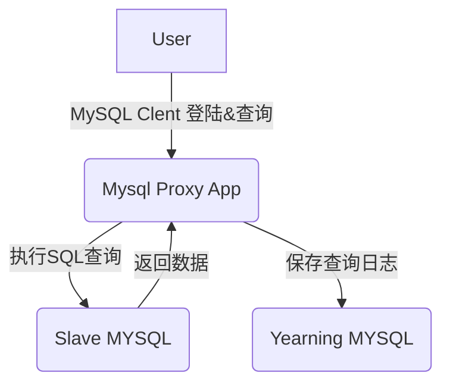

# yearning

- https://github.com/chaiyd/docker.git
- 遵循yearning官方,具体查看yearning官方文档

# mysql proxy
  基于 github.com/go-mysql-org/go-mysql 开发

  根据 yearning 2.3.5 开发的 mysql proxy 
  用于解决 web 操作不便，方便用户使用 mysql client 直连。
  所有操作记录都将保存在 Yearning MYSQL 
  与 Yearning 共用数据库即可

## 注意事项
1. 认证 & 服务 启动后 都是定时刷新
2. 认证 & 服务 有API 手动刷新
  http://serverip:8080/auth
  http://serverip:8080/servers
3. 因 mysql clinet 认证问题需保存密码，以保存数据密码方式进行保存，建议修改后台以下操作点保存密码。
   a. 创建用户
   b. 修改密码
   c. ldap 创建用户 & 登陆
